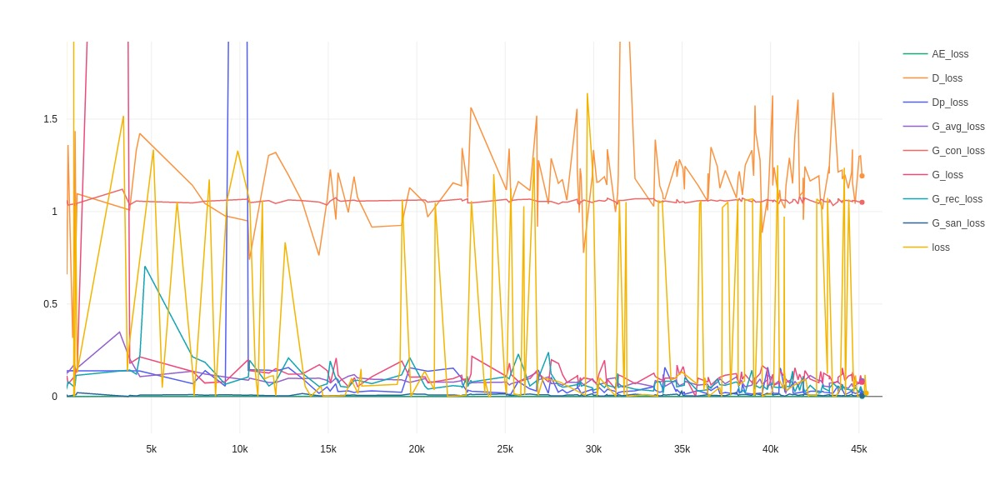

# Contrastive Adversarial Latent AutoEncoder (CALAE)

**Author**: Miles Gray

This is a set of experiments surrounding an image/video dataset of highly complex "fractal" patterns that were originally made using a variety of actual fractal formulas that the I discovered at a time when I had very little mathmematical training.  They are mostly highly parameterized mixtures of the so-called "Kali" set and Mandlebrot/Julia sets, which is where the I started from. However, it seems as though these formula produce significantly more diverse patterns than any other single formula varients of Julia sets that I have seen, though until recently I had not started rigorously looking into the established mathematical literature.

## Current Status

### NOTE

**There is a colab notebook that ties this code together and provides an example of usage - there is now a copy of the notebook in this repo, train_alae.ipynb. This is primarily being made public for resume purposes, it currently lacks the polish of a production ready library - use with caution.** 

This work was done prior to the rise of fourier layers and SIREN style coordinate translation/periodic activations or implicit RGB neural functions and neural radience fields.

### Results

#### Background

Unfortunately, while running these experiments, I realized the importance of preserving the exact codebase and data used in each experiment.  With an external library being downloaded to google colab and then potentially edited within the colab instance, there is no way to reproduce most of the 400+ Comet.ml experiments that I had run.  While I ended up with a fairly good system of ensuring reproducability, I ended up moving on to the new wave of NeRF/SIREN inspired image representations and left this codebase's experiment notebook in a state of suck. While debugging it recently to get an example working, I just replaced many of the losses with one I knew would technically work so I could debug the rest of the training process (a naive FFT based loss). This provides a good example of how a failure case looks like after 16 hours of training (as an aside, the data pipeline is horribly slow). I've also included one of the best results I had gotten, pulled from the comet.ml experiment - I will try to piece together the losses used over the next couple days, but I am fairly sure the contrastive loss that hasn't been debugged yet was a major factor.

#### Examples

The following are some images that show the current fail results along with the closest I had previously gotten to having this model capture the high frequency details of the highly challenging fractal dataset. Output images are arranged in 4 columns - **real samples**, **reconstruction of real**, **fake samples**, **reconstruction of fake** - the exact number of samples depends on the resolution (which determines the batch size). Loss history plots include all of the many losses used (one could easily argue too many), within the range 0-2... the names listed are generic and indicate the algorithmic 'slot' the loss fits into, but part of the design of the framework enabled easily swappable underlying loss calculations within each slot.  In other words, the 'G' loss in the failure case is most likely not the same exact calculation as the 'G' in the success case.

##### Failure Case - 128x128 px final output

##### 'Success' Case - 64x64 final output

# Data
## Julia Sets

[This](http://www.juliasets.dk/Pictures_of_Julia_and_Mandelbrot_sets.htm) is a very good math-based walkthrough of the theories behind generating fractal imagery from Julia set based equations using computers. My ultimate goal is to fully merge the fractal distribution as a prior for a deep AutoEncoder in place of the usual gaussian distribution. 

## Public Dataset

I've added two examples of the data I was testing this with to allow for reproducability:

- https://drive.google.com/file/d/1r9mkx08o33gMjUnTIuPtTnfagygCNfjP/view?usp=sharing

    - A zip file with still images as jpg that have been post processed with photoshop express.

    - Put it in **data/fractal/public_fractal_data.zip** after making a copy in your gdrive to have it work seamlessly with the example notebook.

- https://drive.google.com/file/d/1OO1MnGzJvsHEy2e07Bx48f61CH0IRxxX/view?usp=sharing

    - An mp4 video file at 1080p with a mostly continuous view of one of the fractals progressing along one of the parameters, which gives the illusion of movement - it should be possible to use the same sort of temporal losses used in self-supervised video representation learning. It can also be used as just a dataset like the zip file by using the 'skip' parameter in the frame extraction algorithm provided in the training notebook.

    - Put it in **data/fractal/public_fractal_video.mp4** after making a copy in your gdrive to have it work seamlessly with the example notebook. 

# Adversarial Latent Autoencoder (ALAE) Implementation

**Authors**: Grigorii Sotnikov, Vladimir Gogoryan, Dmitry Smorchkov and Ivan Vovk (all have equal contribution)

This repository was originally a fork of the [third party reimplemntation](https://github.com/ivanvovk/controllable-face-generation/tree/alae-implementation) of ALAE by the above authors. I have since then scoured the web to find all of the latest tricks and strategies that may be helpful to modeling a generative network that can reproduce fractal imagery.  Currently, at the core of the algorithm is still an ALAE and it seems like an appropriate starting point.  

## Generative Network Overview

Based on my survey of the state of the art in generative modeling, the lines between GAN and AutoEncoder have completely blurred and the most successful approaches use at least the following models:

- `Encoder` - This model covnerts images into a latent space so that the latent space can be learned based off the gradients from models that consume the latent space
- `Generator` - A model that takes a latent code as input and outputs an RGB image. It is rarely found using purely random noise as inputs in recent works since there is so much benefit from using a sample from the latent space instead.  
- `Discriminator` - An endpoint of the system that works as a binary classifier to determine whether or not an image is real or if it was produced by the `Generator`. This is one of the main sources of gradient signals for many recent systems.
- `Projector` - This is a recent addition that seem to be a key component to high performant generative systems that rely on latent spaces. It is a model that maps the output of the Encoder into a special latent space specifically for the `Generator` to use. 

In the ALAE setup, for a `real image` to pass through the system, it will go through all 4 of these models during training.  

1. Get `real image` from DataLoader
2. Input `real image` into `Encoder` to obtain `latent code`
3. Input `latent code` into `Projector` to transform into `generative code`
4. Input `generative code` into `Generator` to obtain a `fake image`
5. Input `fake image` into the `Discriminator` which attempts to classify it as a fake image (0 label) as opposed to the `real image` from the DataLoader 

## Other Repositories that are influential

- [Hessian Penalty](https://github.com/wpeebles/hessian_penalty)
- [Contrastive Unpaired Translation](https://github.com/taesungp/contrastive-unpaired-translation)
- [pyro](https://github.com/pyro-ppl/pyro)
- [network bending](https://github.com/terrybroad/network-bending)
- [style-gan](https://github.com/SiskonEmilia/StyleGAN-PyTorch)
- [Fully Adversarial Mosaics](https://github.com/zalandoresearch/famos)
- [PyContrast](https://github.com/HobbitLong/PyContrast)
- [RepDistiller](https://github.com/HobbitLong/RepDistiller)
